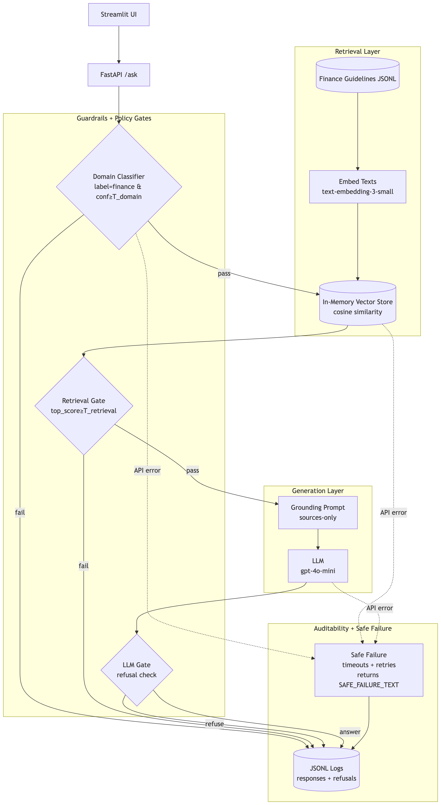

# GuidelineIQ 🤖

> **Production-style RAG system with strict guardrails, auditability, and cost tracking for regulated finance use cases**

GuidelineIQ is a Retrieval-Augmented Generation (RAG) system designed for regulated domains where **accuracy, auditability, and cost control** are critical. It implements a multi-layered guardrail system that ensures answers are only provided when (1) queries are in-scope, (2) retrieval finds strong evidence, and (3) the model can ground answers in that evidence. Otherwise, it **refuses gracefully** with clear, auditable reasons—never hallucinating or providing citations on refusals.

---

## 🎯 Key Features

### **Multi-Layered Guardrails**
- **Domain Classification**: Pre-flight check ensures queries are finance/compliance-related before any retrieval
- **Retrieval Threshold**: Only generates answers when evidence strength exceeds configurable thresholds
- **LLM-Level Refusal**: Model explicitly refuses when sources are insufficient
- **Safe Failure Handling**: Graceful degradation with timeout, retries, and explicit failure messages

### **Production-Oriented Observability**
- **Comprehensive Logging**: Every decision logged to JSONL with full context (classifier outputs, retrieval scores, refusal reasons)
- **Token Usage Tracking**: Detailed token counts and cost estimates for all OpenAI API calls (classifier, embeddings, generation)
- **Request Tracing**: Unique request IDs for end-to-end auditability
- **Structured Refusal Reasons**: Clear categorization of why answers were refused

### **Cost Optimization**
- **Early Exit**: Refusals happen before expensive generation calls when evidence is weak
- **Token Tracking**: Real-time visibility into API costs per query
- **Efficient Embeddings**: Single embedding call per query using `text-embedding-3-small`

---

## 🏗️ Architecture



### **System Flow**

1. **Domain Classification** (`gpt-4o-mini`)
   - Classifies query as `finance`, `non_finance`, or `unsure` with confidence score
   - Threshold: `DOMAIN_CONF_THRESHOLD` (default: `0.6`)
   - Failure → Immediate refusal, no retrieval, no citations

2. **Retrieval** (`text-embedding-3-small` + cosine similarity)
   - Embeds query and retrieves top-k chunks from in-memory vector store
   - Threshold: `RETRIEVAL_SCORE_THRESHOLD` (default: `0.6`)
   - Failure → Refusal before generation (saves cost)

3. **Grounded Generation** (`gpt-4o-mini`)
   - Generates answer strictly from retrieved sources
   - Prompt enforces grounding and refusal when sources are insufficient
   - Failure → Refusal with `llm_refusal` reason

4. **Safe Failure Handling**
   - All OpenAI calls wrapped with timeout (30s) and retries (3 attempts, exponential backoff)
   - On exhaustion → Returns safe refusal: *"I can't answer safely right now."*
   - Logged with failure reason (`classification_failure`, `retrieval_failure`, `generation_failure`)

---

## 📊 Guardrails & Refusal Logic

### **Refusal Reasons**

| Reason | Trigger | Cost Impact |
|--------|---------|-------------|
| `out_of_domain` | Classifier confidence < threshold or label ≠ "finance" | Minimal (only classifier tokens) |
| `no_relevant_docs` | Retrieval returned empty results | Low (classifier + embedding tokens) |
| `low_retrieval_score_pre_generation` | Top retrieval score < threshold | Low (no generation call) |
| `llm_refusal` | Model judged sources insufficient | Full (all stages executed) |
| `classification_failure` / `retrieval_failure` / `generation_failure` | API failures after retries | Variable (depends on failure point) |

### **Key Design Decisions**

- **No citations on refusals**: Ensures users never see misleading source references
- **Early exit on weak evidence**: Saves generation costs when retrieval is weak
- **Structured logging**: Every refusal includes classifier output, retrieval scores, and reason
- **Token tracking**: Full visibility into API costs for cost optimization and budgeting

---

## 📁 Project Structure

```
guideline-iq/
├── api/                    # FastAPI backend
│   ├── app.py              # Application entry point + lifespan
│   ├── routes.py           # /ask, /health, /ready endpoints
│   ├── schemas.py          # Pydantic request/response models
│   ├── settings.py         # Environment variables + thresholds
│   └── logging_utils.py    # JSONL logging helpers
│
├── rag/                    # RAG core logic
│   ├── core.py             # Vector store + cosine similarity
│   ├── llm.py              # OpenAI API calls (embeddings, generation, classifier)
│   ├── prompts.py          # System prompts + refusal text
│   └── types.py            # Type helpers
│
├── ingest/                 # Data ingestion
│   └── loader.py           # JSONL knowledge base loader
│
├── evals/                  # Evaluation framework
│   ├── datasets/
│   │   └── golden.jsonl    # Golden test cases
│   ├── run_eval.py
│   └── metrics.py
│
├── ui/                     # Streamlit frontend
│   └── app_streamlit.py    # Interactive demo UI
│
├── data/                   # Knowledge base
│   └── finance_guidelines.jsonl
│
└── logs/                   # Audit logs
    ├── refusals.jsonl      # All refusals with full context
    └── responses.jsonl     # All responses with usage data
```

---

## 🔧 Configuration

Create a `.env` file in the repository root:

```bash
# Required
OPENAI_API_KEY=your_key_here

# Optional (defaults shown)
DATA_PATH=data/finance_guidelines.jsonl
LOG_DIR=logs
DOMAIN_CONF_THRESHOLD=0.6
RETRIEVAL_SCORE_THRESHOLD=0.6
TOP_K=2
API_BASE_URL=http://localhost:8000
ADMIN_TOKEN=some-secret-value
API_ACCESS_KEY=
ASK_RATE_LIMIT=10/minute
```

Admin logs in the UI are accessible only when `ADMIN_TOKEN` is set and provided.
The UI sends `X-Admin-Token` to protected `/logs/*` endpoints.

### Abuse protection

- `/ask` is rate-limited per IP (default `10/minute`, configurable via `ASK_RATE_LIMIT`).
- Optional API key protection is available via `API_ACCESS_KEY` and `X-API-Key`.
- The Streamlit UI automatically sends `X-API-Key` when `API_ACCESS_KEY` is set.

### **Thresholds Explained**

- **`DOMAIN_CONF_THRESHOLD`**: Minimum classifier confidence to treat query as in-scope. Higher = stricter domain filtering.
- **`RETRIEVAL_SCORE_THRESHOLD`**: Minimum cosine similarity score to proceed to generation. Higher = stricter evidence requirements.
- **`TOP_K`**: Number of chunks retrieved per query. Higher = more context but higher embedding costs.

---

## 🚀 Quick Start

### **Prerequisites**

- Python 3.9+
- OpenAI API key

### **Installation**

```bash
# Clone repository
git clone <repository-url>
cd guideline-iq

# Create virtual environment
python -m venv venv
source venv/bin/activate  # Windows: venv\Scripts\activate

# Install dependencies
pip install -r requirements.txt

# Configure environment
cp .env.example .env  # Edit with your OPENAI_API_KEY
```

### **Run Locally**

**Terminal 1 — API Server**
```bash
uvicorn api.app:app --reload
```
API available at `http://localhost:8000`

**Terminal 2 — UI**
```bash
streamlit run ui/app_streamlit.py
```
UI available at `http://localhost:8501`

### **API Endpoints**

- `GET /ask?q=<query>` — Main Q&A endpoint
- `GET /health` — Liveness check
- `GET /ready` — Readiness check (verifies embeddings loaded)

---

## 📈 Observability & Logging

---

## 🖥️ UI Features

The Streamlit interface includes two main tabs:

### **Assistant**
- Submit finance or compliance questions.
- View grounded answers with citations.
- See refusal decisions when queries are out-of-scope or evidence is weak.

### **Audit**
- View structured request logs for transparency and traceability.
- Inspect classifier decisions, retrieval scores, refusal reasons, and token usage.
- Filter and review recent requests for debugging and evaluation.

> Note: The Audit tab is protected by an admin token in deployed environments.

### **Log Files**

**`logs/refusals.jsonl`** — All refusals with full context:
```json
{
  "event": "refusal",
  "request_id": "uuid",
  "query": "...",
  "reason": "out_of_domain",
  "classifier": {"label": "non_finance", "confidence": 0.3},
  "top_score": null,
  "usage": {
    "classifier": {"total_tokens": 45},
    "retrieval_embedding": {"total_tokens": 0},
    "generation": null,
    "total_tokens": 45,
    "estimated_cost_usd": 0.00000675
  },
  "ts": 1234567890.123
}
```

**`logs/responses.jsonl`** — All responses (answers + refusals):
```json
{
  "request_id": "uuid",
  "query": "...",
  "answer": "...",
  "decision": "answer",
  "confidence": "high",
  "citations": [...],
  "usage": {
    "classifier": {"prompt_tokens": 120, "completion_tokens": 15, "total_tokens": 135},
    "retrieval_embedding": {"total_tokens": 25},
    "generation": {"prompt_tokens": 450, "completion_tokens": 180, "total_tokens": 630},
    "total_tokens": 790,
    "estimated_cost_usd": 0.0001185
  },
  "ts": 1234567890.123
}
```

### **Token Usage & Cost Tracking**

Every response includes detailed token usage:
- **Classifier tokens**: Input + output tokens for domain classification
- **Retrieval embedding tokens**: Tokens used for query embedding
- **Generation tokens**: Input (prompt) + output (completion) tokens
- **Total tokens**: Sum across all stages
- **Estimated cost**: Calculated using OpenAI pricing (as of 2024):
  - Embeddings: $0.02 per 1M tokens
  - GPT-4o-mini input: $0.15 per 1M tokens
  - GPT-4o-mini output: $0.60 per 1M tokens

---

## 🧪 Example Queries

### **In-Scope (Answer with Citations)**
```
"What should a crypto risk warning include for retail customers?"
```
→ Returns answer with citations from FCA guidelines

### **Out-of-Scope (Refusal)**
```
"What is the capital of France?"
```
→ Refusal: `out_of_domain` (no citations)

### **Weak Evidence (Refusal Before Generation)**
```
Finance question phrased so retrieval score < threshold
```
→ Refusal: `low_retrieval_score_pre_generation` (saves generation cost)

---

## 🎓 Why This Project (Portfolio / Interview)

GuidelineIQ explores a core challenge in applied AI:

> How do you design LLM systems that are safe, auditable, and cost-aware in regulated environments?

Rather than maximizing answer rate, this system prioritizes safe refusal when evidence is weak — a critical property for finance and compliance use cases.

### **Production-Oriented Engineering**

- **Modular Architecture**: Clear separation of API layer, RAG core, ingestion, evaluation, and UI.
- **Type Safety**: Pydantic models enforce strict request/response contracts.
- **Resilience**: Timeout + retry logic with exponential backoff for all external API calls.
- **Observability**: Structured JSON logging with request IDs, refusal reasons, and token usage.
- **Cost Awareness**: Early-exit guardrails prevent unnecessary generation calls.

### **Domain Expertise**

- **Guardrail Design**: Multi-layered approach (classifier → retrieval → generation)
- **Refusal Logic**: Clear, auditable refusal reasons suitable for compliance
- **Cost Optimization**: Strategic use of early exits to minimize API costs
- **Knowledge Base Management**: JSONL-based approach for easy expansion

### **Technical Highlights**

- **Vector Search**: In-memory cosine similarity (production would use Pinecone/Weaviate)
- **Embedding Strategy**: Single embedding call per query with efficient model
- **Prompt Engineering**: System prompts enforce grounding and refusal behavior
- **Safe Failure**: Graceful degradation under API failures

---

## ⚖️ Tradeoffs & Limitations

This project is intentionally designed to demonstrate guardrail logic, auditability, and cost-awareness rather than full-scale infrastructure.

- **In-memory vector store**: Chosen for simplicity and clarity. A production deployment would use a persistent vector database (e.g., Pinecone, Weaviate, pgvector).
- **Small evaluation dataset (30 cases)**: Designed to validate guardrail and refusal behavior, not to benchmark large-scale model performance.
- **Single-node architecture**: Focused on correctness and observability. Production systems would include horizontal scaling and async workers.
- **Static knowledge base**: Guidelines are loaded at startup. A production version would support incremental updates, versioning, and monitoring for drift.
- **No authentication layer**: Security concerns such as RBAC, encryption-at-rest, and API rate limiting would be added in a real deployment.

The goal is to clearly demonstrate architectural decisions, safety boundaries, and observability patterns for regulated AI systems.

---

## 📚 Tech Stack

- **Backend**: Python 3.9+, FastAPI
- **Frontend**: Streamlit
- **LLM**: OpenAI (`gpt-4o-mini` for generation/classification, `text-embedding-3-small` for embeddings)
- **Vector Store**: In-memory cosine similarity (no external DB)
- **Logging**: JSONL files for auditability
- **Validation**: Pydantic for request/response schemas

---

## 🔒 Compliance-Oriented Design

- **API Keys**: Stored in `.env` (never committed)
- **Audit Trail**: All decisions logged with full context
- **Refusal Transparency**: Clear reasons for every refusal
- **No Hallucination**: Citations only appear when answers are grounded

---

## 🚀 Scaling Considerations (Production Deployment)

If deployed in a real-world environment, the following improvements would be implemented:

- Replace in-memory vector store with a persistent vector database (e.g., Pinecone, Weaviate, pgvector).
- Add caching layer for repeated queries to reduce embedding and generation costs.
- Move embedding and generation calls to asynchronous workers (Celery / background tasks).
- Containerize services with Docker and deploy behind a load balancer.
- Add structured metrics export (Prometheus / OpenTelemetry).
- Implement authentication, RBAC, and API rate limiting.
- Introduce automated evaluation pipelines integrated into CI/CD.

The current implementation focuses on correctness, safety, and architectural clarity.

## 📝 License

This project is licensed under the Apache License 2.0.

You are free to use, modify, and distribute this software under the terms of the license.

See the [LICENSE](LICENSE) file for details.

**Built using production-oriented engineering principles: reliability, observability, cost control, and explicit safety boundaries.**
